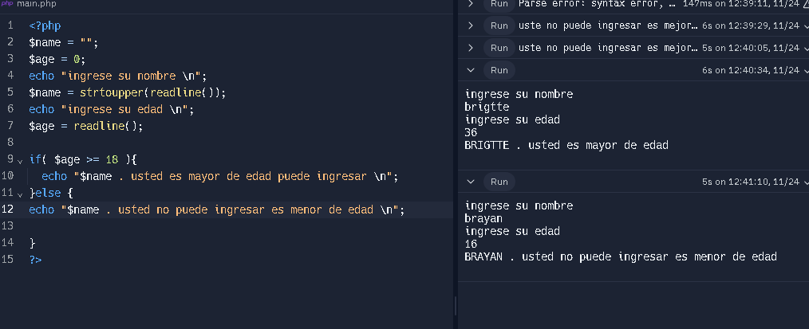

<h1>Taller 10 - Brigitte Bolaños</h1>

<h2>Punto 1: variables y constante </h2>

<h2>Punto 2: suma de constantes y variables </h2>

<h2>punto 3: suma de dos numeros indicados poe el usuario</h2>

<h2>punto 4: Datos del usuario en consola</h2>

<h2>punto 5: entrada de bolera usando if/ else </h2>

<h2>Punto 6: dado el nombre mayor o menor de edad</h2>

<h2>punto 7: seleccion de operacion aritmetica</h2>

<h2>punto 8: entrada de bolera usando switch</h2>

<h2>punto 9: tabala de multiplicar usando while</h2>

<h2>punto 10: numeros usando while</h2>

<h2>punto 11: numeros impares usando for</h2>

<h2>punto 12: tabla de multiplicar usando for </h2>

<h2>punto 13: numeros impares usando for</h2>

<h2>punto 14: Revision de contraseña</h2>

<h2>punto 15: seleccion de operacion aritmetica usando funciones</h2>

